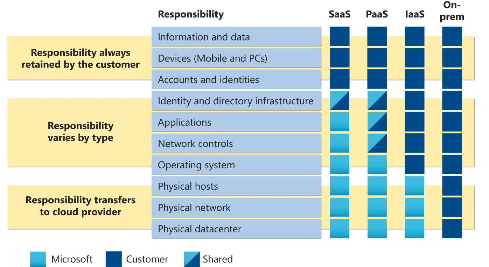

# KCSA

## 4 Cs of Cloud Native Security
1. **Cloud** - Datacenter, Network, Servers.
2. **Cluster** - Authentication, Authorization, Admission, Network Policy.
3. **Containers** - Restrict Images, Supply Chain, Sandboxing, Priveleged.
4. **Code** - Code Security Best Practices.

## Cloud Provider Security:
### Threat Management and Response Techniques
- Azure: Microsoft Sentinet, provides SIEM, SOAR.
- GCP: Security Command Center
- AWS: Guard Duty

### Web Application Firewalls (WAF)
- Azure: Azure WAF, provides security against SQL Injections and XSS Attacks.
- GCP: Google Cloud Armor, provides protection against DDoS Attack.
- AWS: AWS WAF, works as Load Balancer and with AWS CloudFront.

### Container Security:
- Azure: AKS
- GCP: GKE, Google's Anthos, Open Policy Agent.
- AWS: EKS, Bottlerocket, Kube-bench, CIS.

### Shared Responsibility Model:
- Cloud Interface like `network settings`, and `firewall settings` are managed by user.
- Cloud provider manages the `underlying hardware` that user does not has access to.

### Infrastructure Security:
- Network Configuration & Server Hardening.

- **Stages:**
  - **Stage 1**: IP address isolation for each service. Masking public IP address of node, or enforcing VPN access to reduce risk.
  - **Stage 2**: Open ports like Docker port can cause compromise in access. Using firewalls to restrict traffic to port exposing Docker can help. Network policies can also be used for underlying worker node VMs.
  - **Stage 3**: Previleged container can be used to escalate attacker's priveleges to exploit a vulnerability. Adhering to the principle of least privelege can be helpful in this situation. RBAC should be used to restrict the access to the Kubernetes Dashboard.
  - **Stage 4**: Attacker can read credentials stored as environment variables in pods and use them. Using Kubernetes secrets would have protected in this case. Securing etcd by enforcing TLS communication and RBAC.

## Kubernetes Isolation
- Namespace separation for each env like dev, test, prod.
- Multi-tenancy with namespaces.
- Implementing RBAC.
- Resource quota and limits.
- Security contexts to manage user access inside containers or to run them in non-root user mode.
