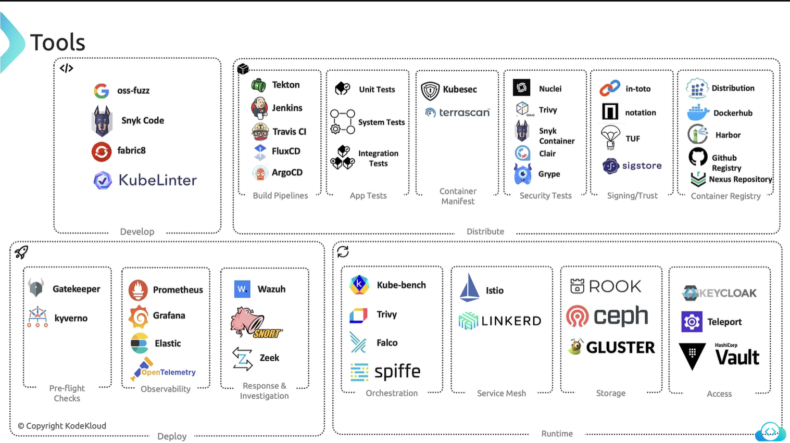

# KCSA

## 4 Cs of Cloud Native Security
1. **Cloud** - Datacenter, Network, Servers.
2. **Cluster** - Authentication, Authorization, Admission, Network Policy.
3. **Containers** - Restrict Images, Supply Chain, Sandboxing, Priveleged.
4. **Code** - Code Security Best Practices.

## Cloud Provider Security:
### Threat Management and Response Techniques
- Azure: Microsoft Sentinet, provides SIEM, SOAR.
- GCP: Security Command Center
- AWS: Guard Duty

### Web Application Firewalls (WAF)
- Azure: Azure WAF, provides security against SQL Injections and XSS Attacks.
- GCP: Google Cloud Armor, provides protection against DDoS Attack.
- AWS: AWS WAF, works as Load Balancer and with AWS CloudFront.

### Container Security:
- Azure: AKS
- GCP: GKE, Google's Anthos, Open Policy Agent.
- AWS: EKS, Bottlerocket, Kube-bench, CIS.

### Shared Responsibility Model:
- Cloud Interface like `network settings`, and `firewall settings` are managed by user.
- Cloud provider manages the `underlying hardware` that user does not has access to.

### Infrastructure Security:
- Network Configuration & Server Hardening.

- **Stages:**
  - **Stage 1**: IP address isolation for each service. Masking public IP address of node, or enforcing VPN access to reduce risk.
  - **Stage 2**: Open ports like Docker port can cause compromise in access. Using firewalls to restrict traffic to port exposing Docker can help. Network policies can also be used for underlying worker node VMs.
  - **Stage 3**: Previleged container can be used to escalate attacker's priveleges to exploit a vulnerability. Adhering to the principle of least privelege can be helpful in this situation. RBAC should be used to restrict the access to the Kubernetes Dashboard.
  - **Stage 4**: Attacker can read credentials stored as environment variables in pods and use them. Using Kubernetes secrets would have protected in this case. Securing etcd by enforcing TLS communication and RBAC.

## Kubernetes Isolation
- Namespace separation for each env like dev, test, prod.
- Multi-tenancy with namespaces.
- Implementing RBAC.
- Resource quota and limits.
- Security contexts to manage user access inside containers or to run them in non-root user mode.

## Artifact Repository and Image Security:
- **Vulnerability Scanning Tools:** Trivy & Clair.
- Use minimal base images from trusted sources.
### Build Artifacts:
- Files generated as a package after build, can be, code, package, WAR file, logs, report, container image. These are often stored in artifact repositories like Docker, Nexus Repository or JFrog.
### Enhancing Image Security with Digital Signatures:
1. Proactive Security Alerts.
2. Addressing Security Concerns.
3. Applying Digital Signatures.
4. Ensuring Image Authenticity.

## Code Level Security Practices:
- SQL Injection Attacks can happen if code is not properly tested.
- **SonarQube:** Detecting problematic code patterns, mitigating identified risks.
- **Third Party Dependencies:** OWASP security check can be performed.
- **Realtime Security Monitoring:** Datadog Application Security Monitoring (ASM).
- **Performance Monitoring:** Sysdig provides deep insights into containerized environments.

## Kubernetes Cluster Component Security

### API Server
- Authentication and Authorization.

### Kubernetes Controller Manager and Scheduler
- Should be run on the separated, isolated node from where the applications are running.
- Managing permissions using RBAC, to restrict these components to certain permissions only.
- Using TLS communication between components for communication.
- Implement auditlogging to these components using tools like Prometheus and Grafana.

### Securing Kubelet
- Kubeadm does not install Kubelet by default.
- By default, you can do anonymous curl on Kube API Server to check the existing pods.
- There are two ports:
  - 10250 - Serves API that allows full access.
  - 10255 - Serves API that allows unauthenticated read-only access.
- This default anonymous access flag (--anonymous-auth) can be set to false. Either in commandline or `kubelet-config.yaml` file.
- Certificates or API bearer tokens can be used by specifying them in commandline when starting kubelet service.
- 

### DUMPS:
**Cloud Native Security Layers:** Cloud -> Clusters -> Containers -> Code.
- Code: Implement TLS, limit port ranges, manage third-party dependencies, and apply static and dynamic code analysis.

**Security Controls & Frameworks:**
- STRIDE: Spoofing, Tampering, Repudiation, Information, Disclosure, Denial of Servcie, Elevation of Privilege.
- Standards & Frameworks: CIS Benchmarks, NIST, CSA, MITRE, ATT&CK, OCTAVE.

**Isolation Techniques:**
- **Namespace:** Ensure process isolation.
- **Network Policies:** Apply Ingress and Egress rules.
- **Policy Enforcement:** Prevent unauthorized actions.
- **RBAC (Role-Based Access Control):** Manage authentication and permissions effectively.

**Workload and Application Code Security:**
- **Workload Security:** Focus on securing the platform and monitoring using tools like `sysdig`.
- **Application Security:** Ensure the code in container images is secure by conducting vulnerability scans. Use automated security tools, enforce RBAC policies, and grant only necessary permissions to containers.
- Tools like `Kube-bench` can enforce security best practices within Kubernetes, including configuring appropriate security contexts.

### Security Principles:
- `Security by Design:` Security should be a design requirement from the start.
- `Secure Configuration:` Secure configurations should offer the best user experience.
- `Informed Choices:` Selecting insecure configurations should be a deliberate and informed choice.
- `Transition to Security:` The system should enable transitioning from insecure to secure states smoothly.
- `Secure Defaults:` Defaults should protect against common vulnerabilities and exploits.
- `Support for Exceptions:` Exceptions to secure configurations should be supported at a high level.
- `Defend Against Exploits:` Secure defaults should defend against widespread vulnerability exploits.
- `Understandable Security Limitations:` The security limitations of any system should be clear and explainable.

### Compliance Frameworks
- Defines what to do.
- **CIS Benchmarks:** Security configuration benchmarks for Kubernetes clusters.
- **NVD (National Vulnerability Database):** A database of known vulnerabilities and exposures.
- **NIST (National Institute of Standards and Technology):** A key resource for security standards and best practices.

### Threat Modeling Frameworks:
- Defines how to do it.
- **STRIDE:** Developed by Microsoft.
- **MITRE ATT&CK:** Deals with tactics and techniques.

### Supply Chain Compliance
- Make sure the external components used are verified and trusted.
- Use CNCF Supply Chain Security.
  - **Artifacts:** Track software components. Keyless signing using tools like `CoSign` to detect tampering in future.
  - **Metadata:** Record information about artifacts. SBOM (Software Bill of Materials), includes components, dependencies, and libraries. It is a file that can be downloaded to verify the integrity of the components of an application.
  - **Attestations:** Verify compliance. Makes sure the data is sent by the authentic source, tools like `in-toto` are used for this.
  - **Policies:** Apply compliance checks to ensure security throughout the supply chain. `policy-controller` for policy enforcement.

### Threat Intelligence:
- **Threat Intelligence:** Gathering indications of specific behaviours of potential attackers.
- **MITRE ATT&CK Framwork:** act as starting point to understand tricks and techniques of attackers.

### Develop -> Distribute -> Deploy -> Runtime
- Security risk management process that spans the development, distribution, deployment, and runtime phases of software lifecycle.

### Automation and Tooling:
- Cloud Native Security Whitepaper
- **Google OSS-Fuzz:** Check Open-Source software bugs and vulenarabilities using fuzz testing.
- **Snyk Code:** VS Code extension.
- **Fabric8 by RedHat:** VS Code extension for IDE based code analysis.
- **KubeLinter:** Checks syntax of manifests.
- **KubeSec:** Scans for vulnerabilites in YAML files.
- **Terrascan:** Works for K8s as well IaC in general for vulnerabilities and compliance issues.
- **Image Scanning:** Nuclei, Trivy, Snyk, Clair, Grype.
- **Signing & Trust:** In-toto, Notation, TUF, Sigstore.
- **Preflight Checks:** Gatekeeper (policy management using YAML), Kyverno, 
- **Observability:** Prometheus, Grafana, Elastic, OpenTelemetry.
- **Response and Mitigation:** Wazuh (Security monitoring and intrusion detection), Snort, Zeek (Network security monitoring).
- **Kubescape:** Scans everything - clusters, pods, and manifests - against CIS benchmarks.
- **Kube-bench:** Focuses on scanning clusters for CIS compliance.
- **Orchestration:** Trivy, Kube-Bench, Falco, Spiffe (Facilitates identity management).
- **Service Mesh:** Istio, Linkerd.
- **Storage:** Rook, CEPH, Gluster.
- **Acess:** KeyCloak, Teleport, HashiCorp Vault.
- **Checkov:** Performs static analysis on manifests and checks for security threats.

### OCTAVE (Operationally Critical Threat, Asset, and Vulnerability Evaluation) threat modeling framework:
- Risk assessment methodology to identify and prioritize information security risks.
- It consists of three phases:
  - **Phase 1:** Identification of critical assets and threats to the system.
  - **Phase 2:** Assessment of vulnerabilities in the infrastructure.
  - **Phase 3:** Development of a security strategy and implementation plan to mitigate identified risks.

- **General Threat Actors:**
  - Malicious Insider.
  - Uninformed Insider.
  - Malicious Insider.

## Multiple Choice Questions (MCQs)

---

### 1. **Question:**

An enterprise utilizing Azure for their cloud solutions requires a tool to perform security analysis and offer actionable recommendations to enhance their security posture.  
**Which Azure service is best suited for this purpose?**

### ✅ **Answer:**

**Azure Security Center**

Azure Security Center is a unified infrastructure security management system that strengthens the security posture of your data centers and provides advanced threat protection across all of your Azure resources.

---

### 2. **Question**
Scenario: A technology firm needs to ensure that all deployments in their Kubernetes cluster adhere to specific security protocols, including mandatory security labels.
**Which feature can enforce these deployment standards within the cluster?**

### ✅ **Answer:**

**Pod Security Admission (PSA)

---

### 3. **Question:**

A company has migrated its services to a public cloud provider. They need to ensure that the virtual machines hosting their applications are properly secured.
**Which entity is responsible for configuring the network security groups and firewalls for these virtual machines?**

### ✅ **Answer:**

**The Customer**

When migrating services to a public cloud provider, the customer is responsible for configuring network security groups and firewalls for their virtual machines to ensure proper security.

---

### 4. **Question**

Scenario: A user disputes a financial transaction, claiming they never authorized it. You need a way to verify the legitimacy of the transaction.
**Which STRIDE category is relevant here, and what solution can help address this issue?**

### ✅ **Answer:**

**Repudiation**

---

### 5. **Question**

Scenario: You are required to automate compliance checks and generate audit reports.
**Which tools are appropriate for this purpose?**

### ✅ **Answer:**

**Chef InSpec and OpenSCAP**