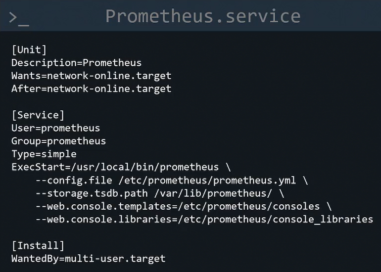

### Prometheus Certified Associate

## Observability

### Introduction to Observability
- The ability to understand and measure the state of a system based upon data generated by the system.
- Allows us to generate actionable outputs from unexpected scenarios in dynamic environments.
- Observability can be accomplished with: `Logging`, `Metrics`, `and Traces` (comprised of spans).

### SLI (Service Level Indicator)
- Quantitative and user-friendly (easily noticeable by user) measure of some of the level fo service that is provided.
- **Example:** Request Latency, Error Rate, Saturation, Throughput, and Availability.

### SLO (Service Level Object)
- Target value or range for an SLI.
- SLI: Latency - SLO: Latency < 100ms

### SLA (Service Level Agreement)
- Contract between a vendor and a user that guarantees a certain SLO.

## Prometheus Fundamentals
- Prometheus is an open-source monitoring tool that collects metrics data, and provide tools to visualize the collected data.
- Allows the generation of alerts when metrics reach a defined threshold.

### Prometheus Architecture
- Retrieval
- TSDB
- HTTP Server
- Exporters

- `Pull-based` approach to fetch metrics.
- Support of `Pushgateway` for short lived jobs.

- Service Discovery support provides dynamic discovery of targets.
- Altertmanager used to send alters to emails or Slack integration.
- Prometheus web ui for visualizing data.

### Collecting Metrics
- Prometheus collects metrics by sending http requests to `/metrics` endpoint of each target.
- Prometheus can be configured to use a different path other than */metrics*.
- Most systems do not collect metrics by default and expose them on HTTP endpoint.
- `Exporters` collect metrics and expose them in a format Prometheus expects.
- Prometheus has several native exporters: Node exporters, Windows, MySQL, Apache, HAProxy.

> Pull based system provides funcitonality to identify if the target is down. Pull based systems have a definitive list of targets to monitor, creating a central source of truth.

> Push based systems can potentially overload mertrics server if too many incoming connections get flooded at the same time. They are best choice for event based systems. *Prometheus is for collecting metrics, not for monitoring events*.

### Installing Prometheus (Systemd)
1. **Creating user**
```bash
# Creating an application user with no to login functionality.
sudo useradd --no-create-home --shell /bin/false prometheus
```

2. **Setting up config**
```bash
sudo mkdir /etc/prometheus # config dir
sudo mkdir /var/lib/prometheus # data dir

# Update permissions
sudo chown prometheus:prometheus /etc/prometheus
sudo chown prometheus:prometheus /var/lib/prometheus
```

3. **Download & Install Binary**
```bash
wget <the-binary-link>
tar xvf prometheus-2.37.0.linux-amd64.tar.gz

sudo cp prometheus /usr/local/bin
sudo cp promtool /usr/local/bin

# update permissions
sudo chown prometheus:prometheus /usr/local/bin/prometheus
sudo chown prometheus:prometheus /usr/local/bin/promtool

# Copy dashboard and visualization data
sudo cp -r consoles /etc/prometheus
sudo cp -r console_libraries /etc/prometheus

sudo chown -R prometheus:prometheus /etc/prometheus/consoles
sudo chown -R prometheus:prometheus /etc/prometheus/console_libraries

# Copy config file
sudo cp prometheus.yaml /etc/prometheus/prometheus.yaml
sudo chown prometheus:prometheus /etc/prometheus/prometheus.yaml

# Start prometheus
sudo -u prometheus /usr/local/bin/prometheus \
--config.file /etc/prometheus/prometheus.yaml \
--storage-tsdb.path /var/lib/prometheus/ \
--web.console.templates=/etc/prometheus/consoles \
--web.console.libraries=etc/prometheus/console_libraries
```

4. **Create and Enable Prometheus service on Startup**
```bash
sudo vi /etc/systemd/system/prometheus.service
sudo systemctl enable prometheus.service
```


5. **Installing Node Exporter (on Linux hosts that need to be monitored)**
```bash
# Go to prometheus website and download the latest binary using wget
wget <node-exporter-download-link>
tar -xvf filename.tar.gz
cd <extracted-folder> # there will be *node_exporter* executable inside it.

sudo cp node_exporter /usr/local/bin/

# Create a user
sudo useradd --no-create-home --shell /bin/false node_exporter

# Create service by following the process similar to what we did for prometheus setup.

# Check if metrics are being exported
curl localhost:9100/metrics
```

### Prometheus Config
```yaml
# This is the main configuration file for Prometheus.
# It defines:
# - Global behavior (scrape & evaluation intervals)
# - Where Prometheus scrapes metrics from
# - Alerting and rule files

# Global Configuration
global:
  # How frequently Prometheus scrapes targets
  # Default is 1m, but 15s is common for faster observability
  scrape_interval: 15s

  # How frequently Prometheus evaluates alert rules
  evaluation_interval: 15s

  # Timeout for scraping a target before marking it as failed
  scrape_timeout: 10s


# Alertmanager Configuration
alerting:
  alertmanagers:
    - static_configs:
        - targets:
            # Alertmanager endpoint(s)
            # Use hostname:port (default port is 9093)
            - "alertmanager:9093"

# Files that contain alerting rules and/or recording rules
rule_files:
  # Load all rule files from this directory
  - "rules/*.yml"

# Each scrape_config defines a set of targets Prometheus will scrape
scrape_configs:
  # Prometheus Self-Monitoring
  - job_name: "prometheus"

    # Override global scrape interval for this job (optional)
    scrape_interval: 15s

    static_configs:
      - targets:
          # Prometheus exposes its own metrics on /metrics
          - "localhost:9090"

  # Node Exporter (Linux Hosts)
  - job_name: "node_exporter"

    static_configs:
      - targets:
          # Node Exporter default port is 9100
          - "node-exporter:9100"

  # Application Metrics
  - job_name: "my_application"

    # Path where the app exposes metrics
    metrics_path: "/metrics"

    # HTTP scheme (http or https)
    scheme: "http"

    static_configs:
      - targets:
          # Replace with your app host(s)
          - "app:8080"

        # Custom labels help identify metrics later
        labels:
          environment: "production"
          service: "backend-api"

  # --------------------------
  # Kubernetes (Example)
  # --------------------------
  # This section demonstrates dynamic service discovery
  # Uncomment and adjust if running inside Kubernetes
  #
  # - job_name: "kubernetes-pods"
  #   kubernetes_sd_configs:
  #     - role: pod
  #
  #   relabel_configs:
  #     # Only scrape pods that have prometheus.io/scrape=true
  #     - source_labels: [__meta_kubernetes_pod_annotation_prometheus_io_scrape]
  #       action: keep
  #       regex: "true"
  #
  #     # Use the annotated metrics path
  #     - source_labels: [__meta_kubernetes_pod_annotation_prometheus_io_path]
  #       action: replace
  #       target_label: __metrics_path__
  #
  #     # Use the annotated port
  #     - source_labels: [__address__, __meta_kubernetes_pod_annotation_prometheus_io_port]
  #       action: replace
  #       regex: (.+):(?:\d+);(\d+)
  #       replacement: $1:$2
  #       target_label: __address__
```